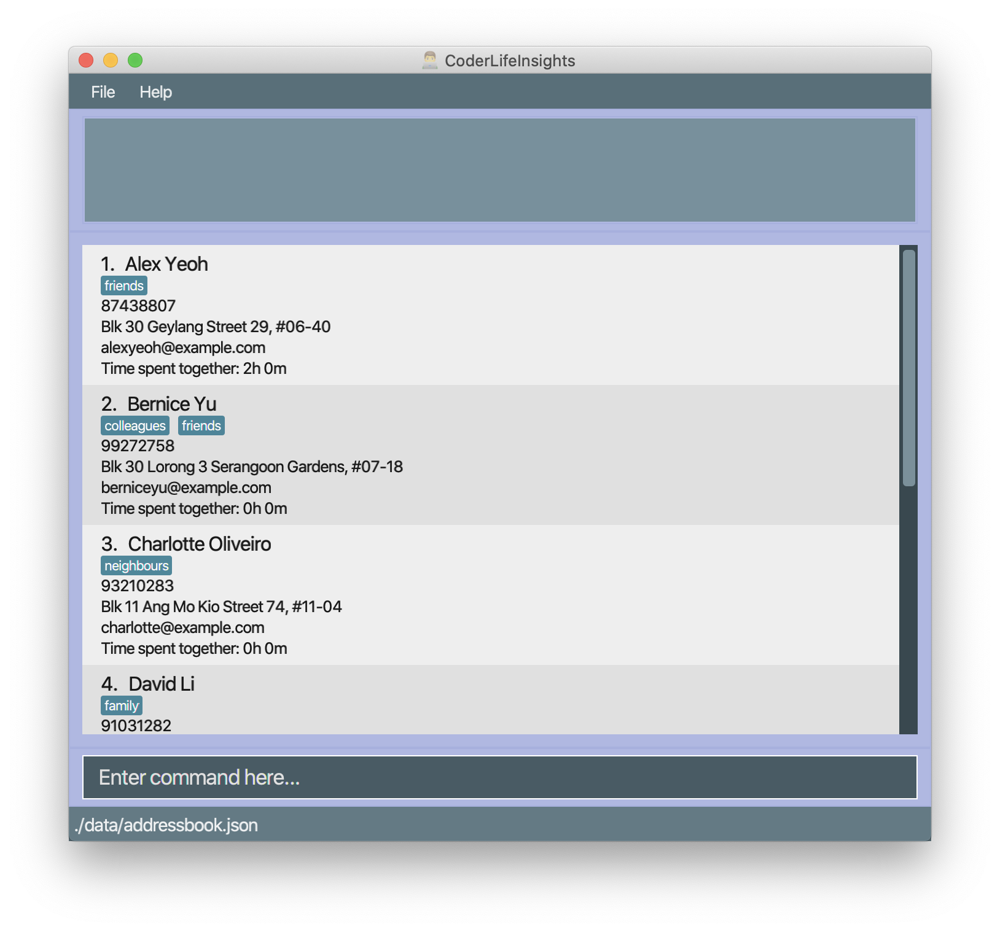

= CoderLifeInsights

image:https://api.codacy.com/project/badge/Grade/3dd835e750584121bf94b97532fc5763[link="https://app.codacy.com/gh/AY1920S2-CS2103-W14-4/main?utm_source=github.com&utm_medium=referral&utm_content=AY1920S2-CS2103-W14-4/main&utm_campaign=Badge_Grade_Settings"]
ifdef::env-github,env-browser[:relfileprefix: docs/]

https://travis-ci.org/AY1920S2-CS2103-W14-4/main[image:https://travis-ci.org/AY1920S2-CS2103-W14-4/main.svg?branch=master[Build Status]]
https://ci.appveyor.com/project/harrychengly/main/branch/master[image:https://ci.appveyor.com/api/projects/status/jfbm08f7kf5r999b/branch/master?svg=true[Build status]]
https://coveralls.io/github/AY1920S2-CS2103-W14-4/main?branch=master[image:https://coveralls.io/repos/github/AY1920S2-CS2103-W14-4/main/badge.svg?branch=master[Coverage Status]]

ifdef::env-github[]

endif::[]

ifndef::env-github[]
image::images/Ui.png[width="600"]
endif::[]

* Hungry for data?
Looking for insights in your social life as a programmer?Look no further!
* CoderLifeInsights (CLI) is a desktop application that provides you insights and suggestions to your social life as a programmer using a CLI (Command Line Interface)
* Keep track of the social interactions you have with your friends and family.
* No dinner plans on a Friday night? Get suggestions on who to call for that Japanese restaurant you're craving.
* Spice up your social life with CoderLifeInsights (CLI)

== Site Map

* <<UserGuide#, User Guide>>
* <<DeveloperGuide#, Developer Guide>>
* <<AboutUs#, About Us>>
* <<ContactUs#, Contact Us>>

== Acknowledgements

* AddressBook-Level3 project created by SE-EDU initiative at https://se-education.org
* Some parts of this sample application were inspired by the excellent http://code.makery.ch/library/javafx-8-tutorial/[Java FX tutorial] by _Marco Jakob_.
* Libraries used: https://openjfx.io/[JavaFX], https://github.com/FasterXML/jackson[Jackson], https://github.com/junit-team/junit5[JUnit5]

== Licence : link:LICENSE[MIT]
